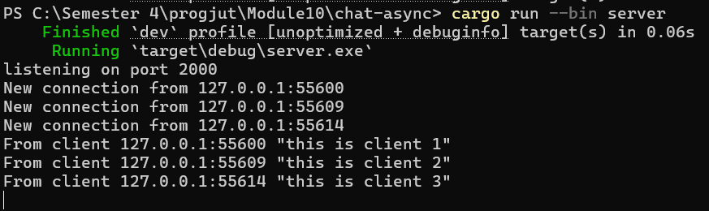
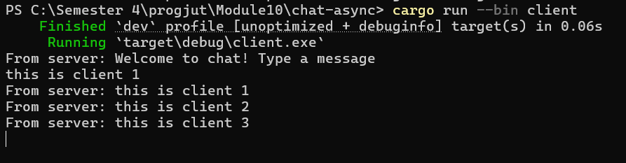
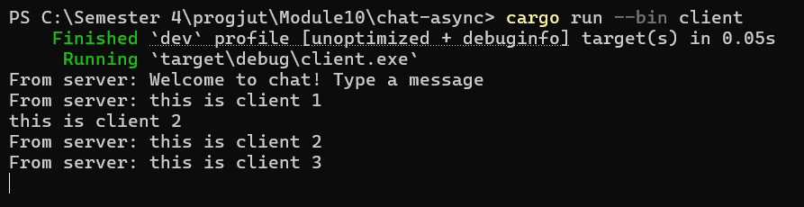
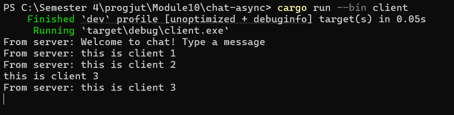
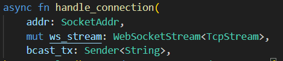
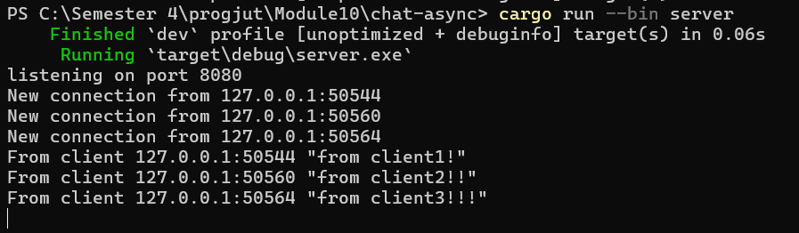
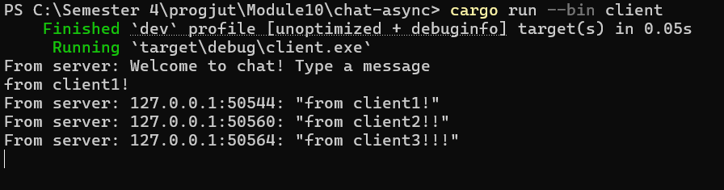
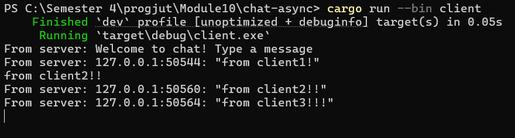
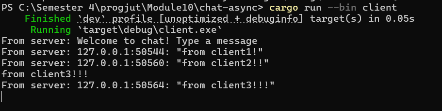

## 2.1 Original code of broadcast chat  
Cara menjalankan server: `Cargo run --bin server`  
Cara menjalankan client: `Cargo run --bin client`  

Server

client 1

client 2

client 3

Ketika server dijalankan, server akan menunggu koneksi dari client. Saat sebuah client dijalankan, client tersebut akan terhubung ke server. Lalu, jika salah satu client mengirimkan pesan, pesan tersebut akan diterima oleh server dan dibroadcast ke client lain yang terhubung ke server.  

## 2.2 Modifying the websocket port  
Setelah mengubah port pada client, kita juga harus mengubah port pada server sehingga server dan client bisa berkomunikasi pada port yang sama. Server juga menggunakan protocol websocket untuk berkomunikasi.  
  
Pada gambar di atas, terlihat bahwa server membungkus TcpStream dalam bentuk WebSocketStream untuk membangun koneksi dengan client.  

## 2.3 Small changes. Add some information to client  
server

client 1

client 2

client 3

Sekarang server akan mengirimkan alamat dari masing masing client bersama dengan pesan yang dikirimkan